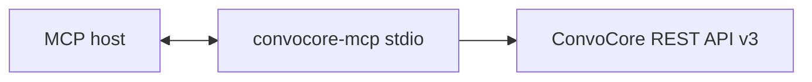

# ConvoCore MCP Server

A [Model Context Protocol (MCP)](https://modelcontextprotocol.io) server that connects AI assistants (Claude Desktop, Cursor, and other MCP hosts) to the **ConvoCore** HTTP API. The host spawns this process, talks to it over **stdio** (standard input/output), and gains **24 tools** for agents, conversations, knowledge bases, and single-URL scraping.

[](https://www.npmjs.com/package/convocore-mcp)
[](https://hub.docker.com/r/moe003/convocore-mcp)
[](https://opensource.org/licenses/MIT)

---

## What this project is

| Piece | Role |
|--------|------|
| **MCP** | A protocol so clients (e.g. Claude) can list and call **tools** with structured arguments and get text (or other) results back. |
| **This server** | A small Node.js app using `@modelcontextprotocol/sdk`: it registers tools, validates arguments with **Zod**, and proxies calls to ConvoCore’s REST API with your **workspace bearer token**. |
| **ConvoCore API** | Backend at `https://{region}-api.vg-stuff.com/v3` (see [Regions](#api-regions-and-base-urls)). Your `WORKSPACE_SECRET` is sent as `Authorization: Bearer …`. |

This repository is **not** a chat UI. It is the **bridge** between an MCP-capable assistant and ConvoCore.

---

## What the server exposes (capabilities)

The server declares **tools only** (no MCP resources or prompts in code). Each successful tool call returns MCP **content** with a single **text** part whose body is **pretty-printed JSON** (`JSON.stringify(result, null, 2)`) from the ConvoCore API response.

| Area | Tools | Purpose |
|------|-------|---------|
| Agents | 9 | CRUD, list, search, export/import template, usage stats |
| Conversations | 8 | CRUD, list with pagination, export (JSON/CSV), assign to user |
| Knowledge base | 6 | CRUD, list, stats (described in-tool as **VG agents** only) |
| Scrape | 1 | Scrape one URL at a time and return the stored page result in the same tool call |
| Interact (WS) | 1 | Drive one agent turn over the `/interact` WebSocket and aggregate the streamed result (plain Markdown **and** UI Engine snapshots) |
| UI Engine | 1 | Static spec for the structured message format agents emit when `vg_enableUIEngine: true` |

---

## How it runs (transport and lifecycle)

1. The **host** (Claude Desktop, Cursor, etc.) starts the server as a subprocess: e.g. `npx -y convocore-mcp`, `docker run …`, or `node dist/index.js`.
2. Communication uses **`StdioServerTransport`**: JSON-RPC messages on stdin/stdout. **Do not** write logs to stdout; the server logs to **stderr** (e.g. `ConvoCore MCP Server running on stdio`).
3. On startup, `getConfig()` reads env vars. If `WORKSPACE_SECRET` is missing, the process **throws** and exits.
4. The host sends `tools/list` and `tools/call`. Each call is validated, then `ConvoCoreClient` performs `fetch()` to the REST API.



---

## Repository layout

| Path | Purpose |
|------|---------|
| `src/index.ts` | MCP server, tool definitions (JSON Schema for hosts), Zod validation, tool dispatch |
| `src/convocore-client.ts` | HTTP client: paths, methods, query strings, JSON bodies |
| `src/config.ts` | `WORKSPACE_SECRET`, `CONVOCORE_API_REGION`, resolved `baseUrl` |
| `src/types.ts` | Shared TypeScript types for config and agent payloads |
| `dist/` | Compiled output (`pnpm run build` / `tsc`) — what npm publishes |
| `Dockerfile` | Multi-stage image: build with pnpm, run `node dist/index.js` (alternative distribution) |
| `docker-compose.yml` | Example service (see [Docker Compose note](#docker-compose)) |
| `claude_desktop_config.example.json` | Sample Claude Desktop MCP entry |
| `openapi.json` | OpenAPI spec (reference for API shape) |

---

## Environment variables

| Variable | Required | Default | Meaning |
|----------|----------|---------|---------|
| `WORKSPACE_SECRET` | **Yes** | — | Bearer token for the ConvoCore workspace (same as API key/secret from your dashboard). |
| `CONVOCORE_API_REGION` | No | `eu-gcp` | `eu-gcp` or `na-gcp`; selects API host (see below). |
| `CONVOCORE_API_BASE_URL` | No | — | Optional full REST base URL override. Useful for local dev, e.g. `http://localhost:5000/v3`. Overrides `CONVOCORE_API_REGION` when set. The `/interact` WebSocket URL is derived from this (scheme swapped to `ws/wss`, path replaced with `/interact`) unless `CONVOCORE_INTERACT_WS_URL` is also set. |
| `CONVOCORE_INTERACT_WS_URL` | No | — | Optional explicit override for **only** the `/interact` WebSocket URL, e.g. `ws://localhost:5000/interact`. Set this when you want REST traffic on prod but WebSocket traffic on a local debug server (or vice-versa). Used verbatim — supply scheme, host, port, and path. |

The server reads `WORKSPACE_SECRET`, `CONVOCORE_API_REGION`, optional `CONVOCORE_API_BASE_URL`, and optional `CONVOCORE_INTERACT_WS_URL`. Any other variables in compose files or docs are ignored unless you wire them yourself.

### API regions and base URLs

| `CONVOCORE_API_REGION` | Base URL |
|------------------------|----------|
| `eu-gcp` | `https://eu-gcp-api.vg-stuff.com/v3` |
| `na-gcp` | `https://na-gcp-api.vg-stuff.com/v3` |

For local development, set `CONVOCORE_API_BASE_URL=http://localhost:5000/v3` to redirect both REST and WebSocket, or set `CONVOCORE_INTERACT_WS_URL=ws://localhost:5000/interact` to redirect only the `/interact` WebSocket while REST keeps using the regional host.

---

## Authentication

Every request from `ConvoCoreClient` includes:

- `Authorization: Bearer <WORKSPACE_SECRET>`
- `Content-Type: application/json`

Non-OK responses: body is parsed as JSON; `message` is thrown as an error when present, otherwise a generic status message. Keep `WORKSPACE_SECRET` out of prompts, screenshots, and shared configs; use env vars or your host’s secret mechanism.

---

## Quick start

### Prerequisites

- A ConvoCore **workspace secret** (`WORKSPACE_SECRET`).
- Optional: correct **region** (`eu-gcp` / `na-gcp`).
- **Node.js 20+** (ships with `npx`). Docker is optional and only needed for the container workflow.

### Option A: npx (recommended)

You don't have to install anything. Your MCP host (Claude Desktop, Cursor, etc.) runs the server on demand:

```bash
npx -y convocore-mcp
```

Set `WORKSPACE_SECRET` (and optionally `CONVOCORE_API_REGION`) in the host's `env` block — see the [Claude Desktop example](#claude-desktop) below.

The first invocation downloads the package (a few seconds); subsequent runs are cached by npm.

### Option B: Docker

```bash
docker run -i --rm \
  -e WORKSPACE_SECRET="your_workspace_secret_here" \
  -e CONVOCORE_API_REGION="eu-gcp" \
  moe003/convocore-mcp:latest
```

`-i` keeps stdin open so the MCP host can speak JSON-RPC to the container.

### Option C: Local Node (development)

```bash
git clone https://github.com/moe003/convocore-mcp.git
cd convocore-mcp
pnpm install
pnpm run build
export WORKSPACE_SECRET="your_workspace_secret_here"
export CONVOCORE_API_REGION="eu-gcp"
node dist/index.js
```

---

## Connecting MCP hosts

### Claude Desktop

Config path:

- **macOS:** `~/Library/Application Support/Claude/claude_desktop_config.json`
- **Windows:** `%APPDATA%\Claude\claude_desktop_config.json`
- **Linux:** `~/.config/Claude/claude_desktop_config.json`

**npx (recommended):**

```json
{
  "mcpServers": {
    "convocore": {
      "command": "npx",
      "args": ["-y", "convocore-mcp"],
      "env": {
        "WORKSPACE_SECRET": "your_workspace_secret_here",
        "CONVOCORE_API_REGION": "eu-gcp"
      }
    }
  }
}
```

> **Windows note:** if Claude Desktop fails to spawn `npx` directly, wrap it with `cmd`:
>
> ```json
> {
>   "mcpServers": {
>     "convocore": {
>       "command": "cmd",
>       "args": ["/c", "npx", "-y", "convocore-mcp"],
>       "env": {
>         "WORKSPACE_SECRET": "your_workspace_secret_here",
>         "CONVOCORE_API_REGION": "eu-gcp"
>       }
>     }
>   }
> }
> ```

After saving the config, **fully quit and relaunch Claude Desktop**. The `convocore` server should appear in the MCP server list and the tools become available in chat.

**Docker (alternative):** pull the image first to avoid first-run timeout in the host:

```bash
docker pull moe003/convocore-mcp:latest
```

```json
{
  "mcpServers": {
    "convocore": {
      "command": "docker",
      "args": [
        "run",
        "-i",
        "--rm",
        "-e", "WORKSPACE_SECRET=your_workspace_secret_here",
        "-e", "CONVOCORE_API_REGION=eu-gcp",
        "moe003/convocore-mcp:latest"
      ]
    }
  }
}
```

**Local Node (development):** use an absolute path to `dist/index.js`:

```json
{
  "mcpServers": {
    "convocore": {
      "command": "node",
      "args": ["/absolute/path/to/convocore-mcp/dist/index.js"],
      "env": {
        "WORKSPACE_SECRET": "your_workspace_secret_here",
        "CONVOCORE_API_REGION": "eu-gcp"
      }
    }
  }
}
```

### Cursor and other clients

Any client that supports **stdio** MCP servers can use the same `command` + `args` + `env` pattern as above. The recommended `command`/`args` is `npx` + `["-y", "convocore-mcp"]`; Docker and local Node also work. Set the same environment variables.

---

## HTTP API mapping (what each tool calls)

All paths are relative to `baseUrl` (e.g. `https://eu-gcp-api.vg-stuff.com/v3`).

| Tool | Method | Path / pattern |
|------|--------|----------------|
| `create_agent` | POST | `/agents` body `{ agent: { … } }` (legacy/raw mode) |
| `create_agent_from_template` | POST workflow | **Preferred** for new agents: scrape URL, synthesize prompt, then create a VG agent from a template backbone |
| `get_agent` | GET | `/agents/{agentId}` |
| `update_agent` | PATCH | `/agents/{agentId}` body `{ agent: { … } }` |
| `delete_agent` | DELETE | `/agents/{agentId}` |
| `list_agents` | GET | `/agents` |
| `search_agents` | GET | `/agents/search?workspaceId=…&page&limit&sortBy&starredOnly&search?` |
| `export_agent` | GET | `/agents/{agentId}/export-template` |
| `import_agent` | POST | `/agents/import-template` |
| `get_agent_usage` | POST | `/agents/{agentId}/usage` body `{ range }` |
| `list_conversations` | GET | `/agents/{agentId}/convos?page&limit` |
| `create_conversation` | POST | `/agents/{agentId}/convos` body `{ conversation }` |
| `get_conversation` | GET | `/agents/{agentId}/convos/{convoId}` |
| `update_conversation` | PATCH | `/agents/{agentId}/convos/{convoId}` body `{ conversation }` |
| `delete_conversation` | DELETE | `/agents/{agentId}/convos/{convoId}` |
| `export_all_conversations` | GET | `/agents/{agentId}/convos/export?format=` |
| `export_conversation` | GET | `/agents/{agentId}/convos/{convoId}/export?format=` |
| `assign_conversation` | POST | `/agents/{agentId}/convos/{convoId}/assign` body `{ assignToUserId, delegatedBy? }` |
| `create_kb_doc` | POST | `/agents/{agentId}/kb` body: KB fields |
| `list_kb_docs` | GET | `/agents/{agentId}/kb?page&pageSize` |
| `get_kb_doc` | GET | `/agents/{agentId}/kb/{docId}` |
| `update_kb_doc` | PATCH | `/agents/{agentId}/kb/{docId}` |
| `delete_kb_doc` | DELETE | `/agents/{agentId}/kb/{docId}` |
| `get_kb_stats` | GET | `/agents/{agentId}/kb/stats` |
| `scrape_url` | POST/GET | Submits one URL for scraping, waits for completion, then returns the scraped page result |
| `interact_with_agent` | WSS | `wss://{region}-gcp-api.vg-stuff.com/interact` (single `InteractObject` in, streamed `ChunkMessage`s out) |
| `get_ui_engine_spec` | n/a | Static reference — does not hit the API |

---

## Tool reference (parameters and notes)

### Agent tools

**`create_agent_from_template`** — **Preferred for almost all from-scratch agent creation.** Required: `url`. Optional: `workspaceId`, `template`, `title`, `description`, `theme`, `language`, `roundedImageURL`, `chatBgURL`, `branding`, `proactiveMessage`, `createKbUrlDoc`, `additionalConfig`.

- Runs pipeline: **scrape URL -> generate start prompt -> create agent from template backbone**.
- `workspaceId` is optional here. If omitted, MCP auto-detects it from your accessible agents.
- The scrape step happens first so the assistant understands what the website is about before creating the agent.
- Forces `agentPlatform` to **`vg`**.
- `template` is one of: `blank`, `customer_support`, `real_estate`, `healthcare_secretary`, `game_npc` (default `customer_support`).
- `createKbUrlDoc` defaults to `true` and auto-adds the source URL to KB.

**`create_agent`** — Legacy direct mode for advanced/manual payload control. Required: `title`. Optional: `description`, `theme`, `disabled`, `light`, `enableVertex`, `autoOpenWidget`, `voiceConfig`, **`nodes`**, `additionalConfig`.

- Prefer `create_agent_from_template` unless you intentionally need low-level manual field control.
- **`nodes`:** ConvoCore’s multi-step graph; **`nodes[0].instructions`** is the **main system prompt**.
- **`additionalConfig`:** Plain object merged into the `agent` payload (same level as other fields). Use for fields not listed explicitly.

**`get_agent`** — Required: `agentId`. Response includes agent JSON; main prompt is under `nodes[0].instructions` when present.

**`update_agent`** — Required: `agentId`. Optional: same agent fields as create; patch semantics depend on API. To change the main prompt, update **`nodes[0].instructions`**.

**`delete_agent`** — Required: `agentId`. Permanent deletion on the API side.

**`list_agents`** — No parameters.

**`search_agents`** — Required: `workspaceId` (org/workspace ID from the ConvoCore dashboard). Optional: `search`, `page` (default 1), `limit` (default 50), `sortBy` (`newest` | `oldest` | `alphabetical`, default `newest`), `starredOnly` (default false).

**`export_agent`** — Required: `agentId`. Returns template JSON for backup/migration.

**`import_agent`** — Required: `agentTemplate`, `agentName`. Optional: `fromAgentId`.

**`get_agent_usage`** — Required: `agentId`. Optional: `range: { from, to }` ISO date strings.

### Conversation tools

**`list_conversations`** — Required: `agentId`. Optional: `page` (default 1), `limit` (default 20).

**`create_conversation`** — Required: `agentId`, `conversation`. The API expects at least a **`ts`** (timestamp) in the conversation object; you may add `userName`, `userEmail`, etc. per your ConvoCore setup.

**`get_conversation`** — Required: `agentId`, `convoId`.

**`update_conversation`** — Required: `agentId`, `convoId`, `conversation` (partial fields).

**`delete_conversation`** — Required: `agentId`, `convoId`.

**`export_all_conversations`** — Required: `agentId`. Optional: `format` — `json` (default) or `csv`.

**`export_conversation`** — Required: `agentId`, `convoId`. Optional: `format` — `json` or `csv`.

**`assign_conversation`** — Required: `agentId`, `convoId`, `assignToUserId`. Optional: `delegatedBy`.

### Knowledge base tools

Tool descriptions in code note **“VG agents only”** — KB operations target `/agents/{id}/kb` and may only apply to supported agent types on the ConvoCore side.

**`create_kb_doc`** — Required: `agentId`, `name`, `sourceType`: `doc` | `url` | `sitemap`.

- **`doc`:** use `content` for text.
- **`url`:** use `urls` (array), optional `scrapeContent`.
- **`sitemap`:** use `sitemapUrl`, optional `maxPages`.

Optional: `metadata`, `tags`, `refreshRate` — `6h` | `12h` | `24h` | `7d` | `never` (default `never` in schema).

**`list_kb_docs`** — Required: `agentId`. Optional: `page` (default 1), `pageSize` (default 20).

**`get_kb_doc`** — Required: `agentId`, `docId`.

**`update_kb_doc`** — Required: `agentId`, `docId`. Optional: `name`, `content`, `metadata`, `tags`, `refreshRate`, `url`.

**`delete_kb_doc`** — Required: `agentId`, `docId`.

**`get_kb_stats`** — Required: `agentId`.

### Scrape tool

**`scrape_url`** — Required: `workspaceId`, `url`. Scrapes exactly one URL, does not follow discovered links, waits up to 120 seconds for completion, then returns the job state plus the first scraped page payload when available.

### Interact (WebSocket) tool

`interact_with_agent` is the only WebSocket-backed tool. It opens a single connection to `wss://{region}-gcp-api.vg-stuff.com/interact`, sends one `InteractObject`, and aggregates every streamed `ChunkMessage` (`chunk` / `debug` / `action` / `metadata` / `sync_chat_history`) into one MCP response. Authentication uses the same `Authorization: Bearer <WORKSPACE_SECRET>` header as REST.

**Required:** `agentId`, `convoId`.

**Common optional:**

- `prompt` — User message. Special values: `"start"` (initial greeting), `"@cancel:<reason>"`, `"@rewind:<nodeId>"` (v2/node agents).
- `bucket` — `voiceglow-eu` or `(default)`. Auto-derived from `CONVOCORE_API_REGION` (eu-gcp → `voiceglow-eu`, na-gcp → `(default)`); only override to deliberately cross regions.
- `messageType` + `visualPayload` — for image turns.
- `replyTo` — reply context for a previous message.
- `lightConvoData` — `userName`, `userEmail`, `userPhone`, `origin`, `capturedVariables`, etc. Surfaced into the agent's system prompt where supported.
- `agentData` / `workspaceData` / `turnsHistory` — overrides that skip Firestore loads.
- `disableUiEngine`, `disableRecordHistory`, `v2`, `isTest`, `isLLMStudio`, `kbPreview`, `agentProfileId`, `toolTest`, `formSubmissionMetadata`, `initNodesOptions` — same flags as the underlying `EWSInteractModel`.
- `timeoutMs` (default `120000`, max `600000`) — how long the MCP waits for the streamed turn before forcing the WebSocket closed.
- `raw` (default `false`) — when true, the response includes every raw streamed chunk; when false, only the aggregated text + actions + metadata + final turns are returned (cheaper on tokens).

**Response shape (default `raw: false`):**

```json
{
  "assistantText": "...",
  "uiEngineEnabled": false,
  "uiEngineSnapshot": null,
  "uiEngineSummary": [],
  "actions": [],
  "metadata": { "inputTokens": 0, "outputTokens": 0, "llmUsed": "...", "sources": [], "turns": [] },
  "turns": [],
  "closeCode": 1000,
  "closeReason": "",
  "durationMs": 1234,
  "timedOut": false,
  "chunkCount": 17
}
```

#### UI Engine handling

When the agent has `vg_enableUIEngine: true` (and the request did not pass `disableUiEngine: true`), the server streams **JSON-stringified `TurnProps` snapshots** instead of plain text. UI Engine snapshots are **overwriting** (each chunk is a full snapshot of the bot turn so far) — `interact_with_agent` parses them, keeps only the **latest** snapshot as `uiEngineSnapshot`, and produces a compact `uiEngineSummary` for quick scanning:

```json
{
  "assistantText": "",
  "uiEngineEnabled": true,
  "uiEngineSnapshot": {
    "from": "bot",
    "ts": 1719931200,
    "messages": [
      { "from": "bot", "type": "text",   "item": { "type": "text",   "payload": { "message": "Pick one:" } } },
      { "from": "bot", "type": "choice", "item": { "type": "choice", "payload": { "buttons": [ { "name": "Pricing", "request": { "type": "text", "payload": { "message": "Tell me about pricing" } } } ] } } }
    ]
  },
  "uiEngineSummary": [
    { "index": 0, "type": "text",   "summary": "Pick one:",                 "webChannelOnly": false },
    { "index": 1, "type": "choice", "summary": "1 button: Pricing",         "webChannelOnly": false }
  ],
  "...": "..."
}
```

The eight UI Engine message types are `text`, `choice`, `visual`, `cardV2`, `carousel`, `iFrame`, `form`, `input`. **`form` and `input` are emitted only on web channels** (`web-chat` / `text` origin). Call **`get_ui_engine_spec`** before testing or building UI-Engine-enabled agents to load the full schema.

> **Cost note:** every call runs a real agent turn (LLM + voice + tools) and consumes ConvoCore credits exactly like a normal chat. It is not a dry-run.

### UI Engine spec tool

**`get_ui_engine_spec`** — Returns the full Convocore UI Engine schema. Static knowledge, no API call, no credits.

- Required: none.
- Optional: `section` — `"all"` (default) | `"meta"` | `"envelopes"` | `"message_types"` | `"shared"` | `"rules"` | `"checklist"` | `"primer"`.
- Optional: `messageType` — `"text" | "choice" | "visual" | "cardV2" | "carousel" | "iFrame" | "form" | "input"`. When set, returns just that message-type schema (overrides `section`).

Use this BEFORE:

1. Validating output from `interact_with_agent` against a UI-Engine-enabled agent.
2. Creating / updating an agent whose system prompt should teach the model to emit UI Engine messages — bake the relevant rules and `messageType` shapes into `nodes[0].instructions`.

---

## ConvoCore concepts: nodes and prompts

- Each **node** can represent a step in a workflow.
- The **first node** (`nodes[0]`) holds the **primary instructions** (`instructions` field) that define default agent behavior.
- **`light` mode** (agent flag): described in-tool as no chat history retention for privacy.

---

## Errors and validation

- **Invalid tool arguments:** Zod validation fails → error with `Invalid arguments: …`.
- **Unknown tool name:** thrown as `Unknown tool: …`.
- **API errors:** thrown with the message from the JSON body when available.
- **Startup:** missing `WORKSPACE_SECRET` → configuration error before the server connects.

---

## Natural language examples (for end users)

After configuration, users can ask their assistant things like:

- “List all my ConvoCore agents” → `list_agents`
- “Create an agent for this website from scratch” → `create_agent_from_template` (preferred default)
- “Export all conversations for agent … as CSV” → `export_all_conversations`
- “Add a URL source to the KB for agent …” → `create_kb_doc` with `sourceType: url`
- “Scrape this URL for workspace … and return the result” → `scrape_url`

Exact tool choice and arguments are up to the host model; the **tool descriptions** in `src/index.ts` are what the model sees.

---

## Docker

```bash
docker pull moe003/convocore-mcp:latest
```

Common tags (see Docker Hub for current list): `latest`, version tags such as `2.0.0` / `1.0.x` as published by the maintainer.

Build locally:

```bash
docker build -t moe003/convocore-mcp:latest .
```

### Docker Compose

The included `docker-compose.yml` runs the image with **stdin open** for MCP-style use. Set `WORKSPACE_SECRET` and optionally `CONVOCORE_API_REGION` in your environment or an `.env` file beside the compose file. Authentication is **`WORKSPACE_SECRET` only** (no separate API key variable is read by the server).

---

## Development

| Command | Action |
|---------|--------|
| `pnpm install` | Install dependencies |
| `pnpm run build` | Run `tsc` → `dist/` and chmod the bin |
| `pnpm run dev` | `tsc --watch` |

Dependencies: `@modelcontextprotocol/sdk`, `zod`, plus file-reader stack (`mammoth`, `pdf-parse`, `xlsx`, `sharp`, `mime-types`). Dev: `typescript`, `@types/node`, `shx`.

### Publish to npm (maintainers)

```bash
pnpm install
pnpm run build
pnpm pack --dry-run     # sanity check the tarball
pnpm publish --access public
```

`prepublishOnly` re-runs the build automatically. Only `dist/`, `README.md`, and `LICENSE` are shipped (controlled by the `files` field in `package.json`).

### Push Docker image (maintainers)

```bash
docker push moe003/convocore-mcp:latest
```

---

## Contributing and license

Contributions are welcome via pull request.

MIT License — see the `LICENSE` file.

---

## Links

- [ConvoCore API / product docs](https://convocore.ai/docs)
- [Model Context Protocol](https://modelcontextprotocol.io)
- [npm — convocore-mcp](https://www.npmjs.com/package/convocore-mcp)
- [Docker Hub — moe003/convocore-mcp](https://hub.docker.com/r/moe003/convocore-mcp)
- [Issues](https://github.com/moe003/convocore-mcp/issues)
- [ConvoCore support](https://convocore.ai/support)

---

Built for the ConvoCore community.
